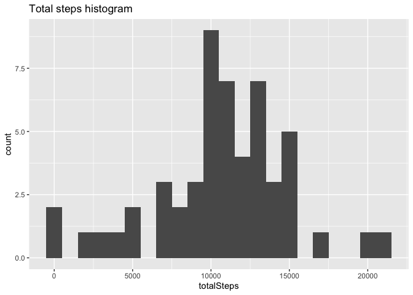
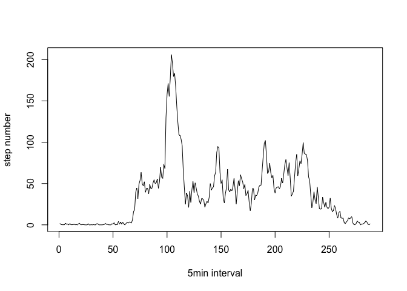
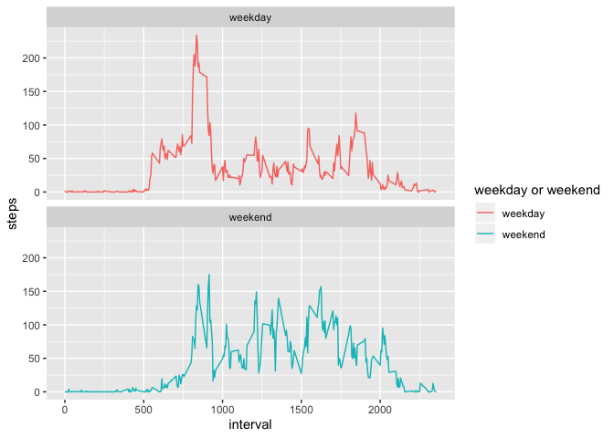

## Loading and preprocessing the data
file activity.zip is unzipped in the current folder nad read as .csv file  
the data then is saved as data table

```r
library("data.table")
library("ggplot2")

unzip("activity.zip")
dataACT<-read.table("activity.csv", sep=",",header=TRUE)
DT1<-setDT(dataACT)
```

## What is mean total number of steps taken per day?
1.Number of total steps per day

```r
res1<-DT1[, .(totalSteps=sum((steps), na.rm = FALSE)), by= date]
print(head(res1), right = T)
```

```
##          date totalSteps
## 1: 2012-10-01         NA
## 2: 2012-10-02        126
## 3: 2012-10-03      11352
## 4: 2012-10-04      12116
## 5: 2012-10-05      13294
## 6: 2012-10-06      15420
```
2. Histogram of total steps

```r
g<-ggplot(res1,aes(x=totalSteps))+
geom_histogram(binwidth = 1000)+labs(title="Total steps histogram")
print(g)
```

<!-- -->
  
3. Mean and the median of the steps taken per day

```r
MM<-res1[, .(Mean=mean((totalSteps), na.rm = TRUE),Median=.(median((totalSteps), na.rm = TRUE)))]
print(MM)
```

```
##        Mean Median
## 1: 10766.19  10765
```
## What is the average daily activity pattern?
1.Make a time series plot of the 5-minute interval (x-axis) and the average number of steps taken, averaged across all days (y-axis)

```r
res2<-DT1[, .(avSteps=mean((steps), na.rm = TRUE)), by= interval]
plot((res2$avSteps), ylab="step number", xlab="5min interval", type = "l")
```

<!-- -->
  
2.Which 5-minute interval, on average across all the days in the dataset, contains the maximum number of steps?

```r
maxInt<-res2$interval[which(res2$avSteps==max(res2$avSteps))]
print(maxInt)
```

```
## [1] 835
```

## Imputing missing values
1.Calculate and report the total number of missing values in the dataset (i.e. the total number of rows NAs)

```r
sum(is.na(dataACT$steps))
```

```
## [1] 2304
```
  
2.Devise a strategy for filling in all of the missing values in the dataset.  
The strategy does not need to be sophisticated.  
For example, you could use the mean/median for that day, or the mean for that 5-minute interval, etc.  
Here missing values will be imputed as average value for every 5-min interval across the days.  
And create a new data set with imputed values

```r
DT2<-DT1
dtx<-merge(DT2,res2, by="interval")[order(date,interval),]
DT2[is.na(steps),"steps"]<-dtx$avSteps[is.na(DT2$steps)]
head(DT2)
```

```
##    steps       date interval
## 1:     1 2012-10-01        0
## 2:     0 2012-10-01        5
## 3:     0 2012-10-01       10
## 4:     0 2012-10-01       15
## 5:     0 2012-10-01       20
## 6:     2 2012-10-01       25
```
  
3.Make a histogram of the total number of steps taken each day and Calculate and report the mean and median total number of steps taken per day. Do these values differ from the estimates from the first part of the assignment? What is the impact of imputing missing data on the estimates of the total daily number of steps?

```r
res3<-DT2[, .(totalSteps=sum((steps), na.rm = FALSE)), by= date]
g<-ggplot(res1,aes(x=totalSteps))+
  geom_histogram(binwidth = 1000)+labs(title  = "Total steps histogram after NA imputing")
print(g)
```

<!-- -->
  
4.Calculate and report the mean and median of the total number of steps taken per day

```r
MM2<-res3[, .(Mean=mean((totalSteps), na.rm = TRUE),Median=.(median((totalSteps), na.rm = TRUE)))]
print(MM2)
```

```
##        Mean Median
## 1: 10749.77  10641
```
  
5.What is the impact of imputing missing data on the estimates of the total daily number of steps?  

```r
cbind(rbind(MM,MM2),`imputing NA`=c("without","with"))
```

```
##        Mean Median imputing NA
## 1: 10766.19  10765     without
## 2: 10749.77  10641        with
```

## Are there differences in activity patterns between weekdays and weekends?
1.Create a new factor variable in the dataset with two levels – “weekday” and “weekend” indicating whether a given date is a weekday or weekend day.

```r
Days<-weekdays(as.Date(DT1$date))
Days[grepl("Monday|Tuesday|Wednesday|Thursday|Friday",Days)]<-"weekday"
Days[grepl("Saturday|Sunday",Days)]<-"weekend"

DT3<-cbind(DT1,"weekday or weekend"= as.factor(Days))
head(DT3)
```

```
##    steps       date interval weekday or weekend
## 1:    NA 2012-10-01        0            weekday
## 2:    NA 2012-10-01        5            weekday
## 3:    NA 2012-10-01       10            weekday
## 4:    NA 2012-10-01       15            weekday
## 5:    NA 2012-10-01       20            weekday
## 6:    NA 2012-10-01       25            weekday
```
2. Make a panel plot containtg time series of the 5-minute interval (x-axis) and the average number of steps taken, averaged across all days (y-axis) to show the difference beween weekdays and weekend 

```r
res5<-DT3[,mean(steps,na.rm=TRUE), by=.(interval, `weekday or weekend`)]

g<-ggplot(res5,aes(x=interval, y=V1, color=`weekday or weekend`))+
geom_line()+facet_wrap(~`weekday or weekend`, ncol = 1, nrow = 2)+ylab(label="steps")
print(g)
```

<!-- -->
